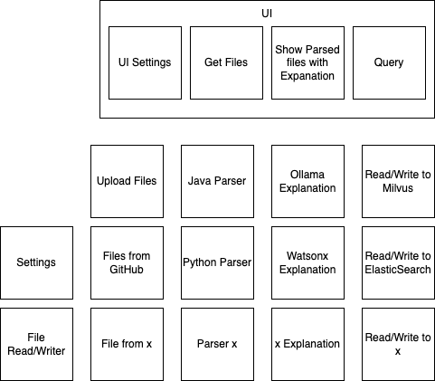

# Project CodeClarity
Handles Java, Python, and enterprise COBOL programs



# Running
```
streamlist run __main__.py
```
or
```
python -m streamlit run __main__.py
```

### Ollama settings
If using Ollama then parallel threads need to be set by either setting it in the [configuration](https://github.com/ollama/ollama/blob/main/docs/faq.md#how-do-i-configure-ollama-server) by setting
```
OLLAMA_NUM_PARALLEL=10
```
or on the command line 
```
OLLAMA_NUM_PARALLEL=10 ollama serve
```

The number of parallel threads needs to be 10 or greater.
